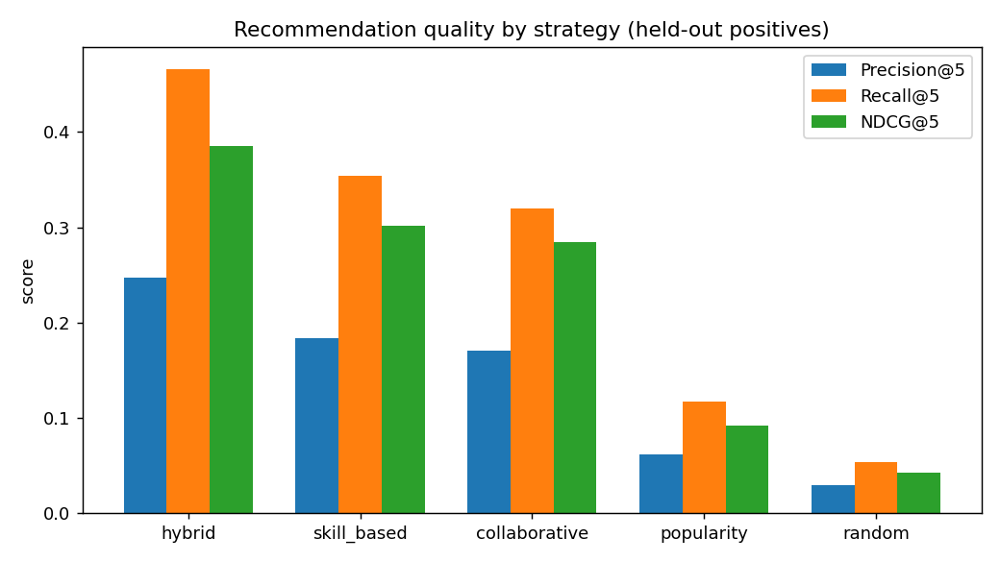
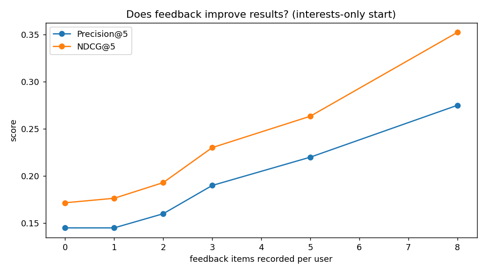

# Evaluation Report

_Generated 2026-10-10 by `scripts/evaluate.py`._

## 1. Summary

| Check | Result | Value |
|---|---|---|
| Response time p95 < 500 ms | PASS | 23.83 ms |
| Throughput >= 10 req/s | PASS | 1113.6 req/s |
| No failed requests | PASS | 0 errors |
| Hybrid beats popularity (NDCG@5) | PASS | 0.385 vs 0.092 |
| Hybrid beats random (NDCG@5) | PASS | 0.385 vs 0.043 |
| Feedback improves precision@5 | PASS | 0.145 -> 0.275 |

## 2. Dataset and protocol

- Synthetic dataset: **152 users**, **100 content items**, 2029 interactions (seeded, reproducible).
- Evaluated users: **148** (users with at least 4 positive interactions).
- 30% of each user's positive interactions (like, complete, rating >= 4) are held out; the engine only sees the rest.
- Metrics are computed at k = 5. Items a user already interacted with are never recommended.

## 3. Strategy comparison

| Strategy | Precision@5 | Recall@5 | NDCG@5 | Catalog coverage |
|---|---|---|---|---|
| hybrid | 0.247 | 0.466 | 0.385 | 0.930 |
| skill_based | 0.184 | 0.354 | 0.301 | 0.950 |
| collaborative | 0.170 | 0.320 | 0.285 | 0.780 |
| popularity | 0.062 | 0.117 | 0.092 | 0.140 |
| random | 0.029 | 0.054 | 0.043 | - |

`random` is the average of 30 random draws (lower bound).



## 4. Does feedback improve results?

40 probe users start with **interests only** (no history, no skills). Their real interactions are fed one at a time through `record_feedback`, and recommendations are scored against held-out items.

| Feedback items | Strategy path | Precision@5 | Recall@5 | NDCG@5 |
|---|---|---|---|---|
| 0 | cold_start | 0.145 | 0.200 | 0.172 |
| 1 | hybrid | 0.145 | 0.198 | 0.176 |
| 2 | hybrid | 0.160 | 0.219 | 0.193 |
| 3 | hybrid | 0.190 | 0.256 | 0.230 |
| 5 | hybrid | 0.220 | 0.300 | 0.263 |
| 8 | hybrid | 0.275 | 0.373 | 0.352 |



## 5. Load test (10 concurrent simulated users)

In-process run of the Flask app (90% `GET /recommend`, 10% `POST /feedback`).

| Metric | Value |
|---|---|
| Concurrent workers | 10 |
| Total requests | 1000 |
| Errors | 0 |
| Throughput | 1113.6 req/s |
| Latency avg / p50 | 8.51 / 2.81 ms |
| Latency p95 / p99 / max | 23.83 / 40.71 / 75.64 ms |
| Cache hit rate | 83.3% |

## 6. Reproduce

```bash
python scripts/evaluate.py
python scripts/load_test.py --workers 10 --requests 100
pytest --cov=data --cov=engine --cov=api
```
